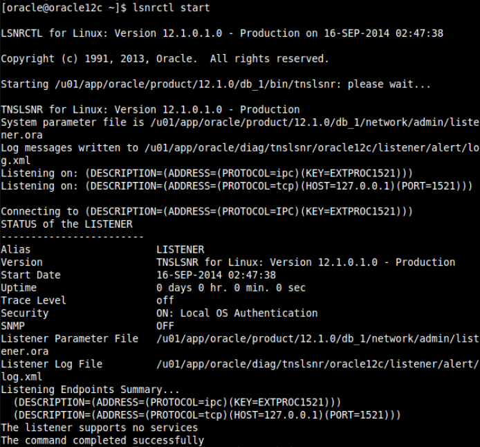
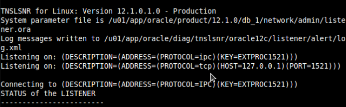
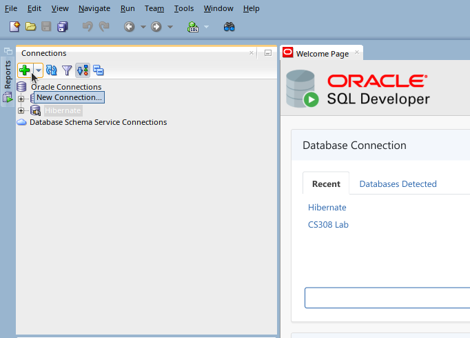
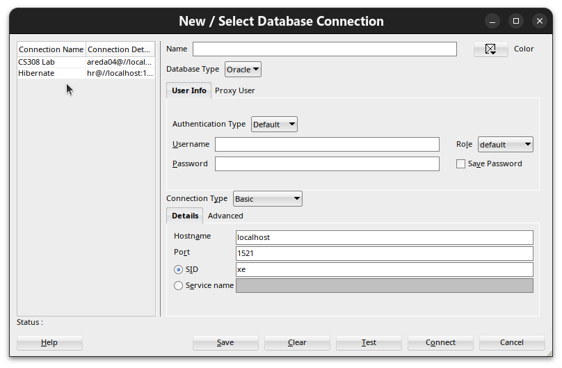
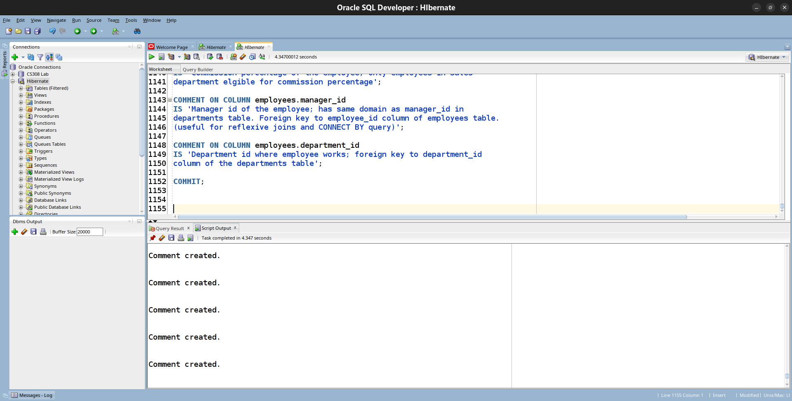
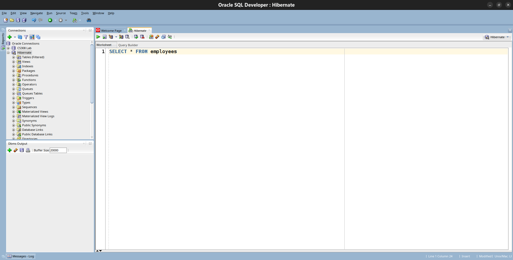
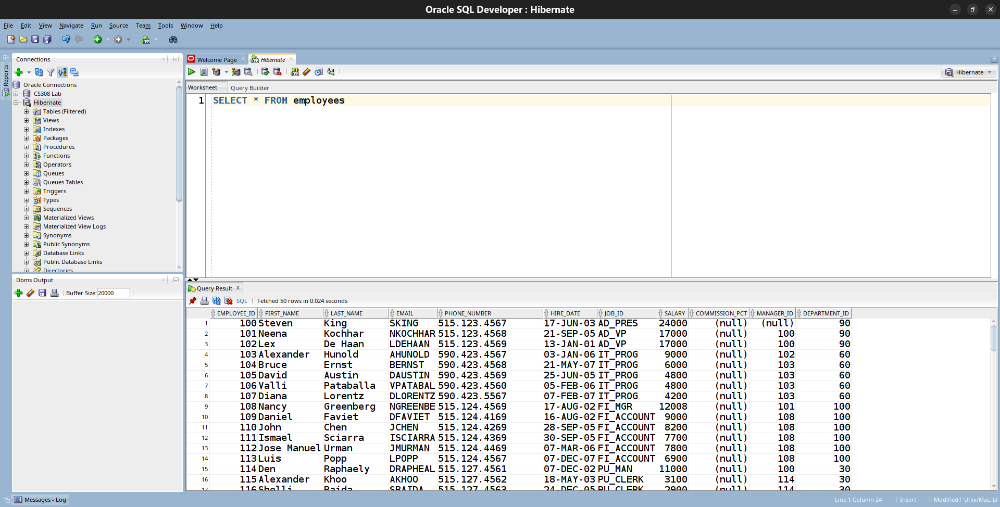

# Oracle/SQL Setup Guide on Windows (For CS307 Course)

---

## Disclaimer

- This guide is for **educational purposes only** (i.e., studying/training) — do not use it in production.

```
#include <std_disclaimer.h>
/*
 * I am not responsible for bricked software, dead SSDs, non-genuine OSes,
 * thermonuclear war, or you getting fired because the alarm app failed. Please
 * do some research if you have any concerns about applying this to your project.
 * YOU are choosing to make these modifications, and if
 * you point the finger at me for messing up your project, I will ignore it.
 */
```

---

## Requirements

- just **you** and an **internet connection**

---

> - This guide is used for Windows only.

---

### Step 1 (Windows): download **Oracle Database XE**

download it from this link [Oracle Database 21c (XE) Download](https://download.oracle.com/otn-pub/otn_software/db-express/OracleXE213_Win64.zip)
extract it & install it 

---

### Step 2 (Windows): Restart your device

---

### Step 3 (Windows): get your user credentials to connect it to **SQL Developer** & **Oracle** later

> we need actually now `host` and `port`

Open Command Prompt (as administrator) and run:
```
lsnrctl start
```
or
```
lsnrctl status
```
It outputs **Listeners** and other details as shown below:



Find the line containing `ADDRESS=(PROTOCOL=tcp)` as indicated below:



From this line:
```
Listening on: (DESCRIPTION=(ADDRESS=(PROTOCOL=tcp)(HOST=127.0.0.1)(PORT=1521)))
```
Extract the host and port as follows:
- After `HOST`: **host** = `127.0.0.1`
- After `PORT`: **port** = `1521`

---

### Step 4 (Windows): Create Your User for Connecting It to Our Database

Open new command prompt window and run:
````
sqlplus / as sysdba
````
it will get you this output .... as below
````
SQL*Plus: Release 21.0.0.0.0 - Production on Sat May 9 16:54:10 2026
Version 21.3.0.0.0
Copyright (c) 1982, 2021, Oracle.  All rights reserved.
Connected to:
Oracle Database 21c Express Edition Release 21.0.0.0.0 - Production
Version 21.3.0.0.0
SQL>
````
> Note: if it gets something like `sqlplus isn't a commmand`, check your oracle setup or re-install oracle

Generally, in the same command prompt window that shows `SQL>`, run the following **Line by Line** (i.e., copy and paste the line, then press `Enter` and go to the next line until it is finished):

And replace each `(Username)` with your username and `(Password)` with your password.

1. `ALTER SESSION SET CONTAINER = XEPDB1;` (this means your `service name` will be `XEPDB1`).
2. `DROP USER (Username) CASCADE;` (if you previously created a user with your new username, skip it if it's your first time to create users or something else).
3. `CREATE USER (Username) IDENTIFIED BY (Password);`
4. `ALTER USER (Username) DEFAULT TABLESPACE users QUOTA UNLIMITED ON users;`
5. `ALTER USER (Username) TEMPORARY TABLESPACE TEMP;`
6. `GRANT CONNECT TO (Username);`
7. `GRANT CREATE SESSION, CREATE VIEW, CREATE TABLE, ALTER SESSION, CREATE SEQUENCE TO (Username);`
8. `GRANT CREATE SYNONYM, CREATE DATABASE LINK, RESOURCE, UNLIMITED TABLESPACE TO (Username);`
9. `GRANT CREATE TRIGGER TO (Username);`

It must output in each line something like `USER CREATED`, `USER ALTERED`, `SESSION ALTERED`, or something that says it works correctly.

> **Note:** If you face errors in any line, just repeat Step 5 and complete Step 6 from where you stopped and what you faced an error in.

We will make a user with **Username =** `hr` and **Password =** `hr` (for the first time).

i.e., run these commands inside `SQL>`:

1. `ALTER SESSION SET CONTAINER = XEPDB1;`
2. `DROP USER hr CASCADE;` (if you previously created a user with `hr` username, skip it if it's your first time to create users or something else).
3. `CREATE USER hr IDENTIFIED BY hr;`
4. `ALTER USER hr DEFAULT TABLESPACE users QUOTA UNLIMITED ON users;`
5. `ALTER USER hr TEMPORARY TABLESPACE TEMP;`
6. `GRANT CONNECT TO hr;`
7. `GRANT CREATE SESSION, CREATE VIEW, CREATE TABLE, ALTER SESSION, CREATE SEQUENCE TO hr;`
8. `GRANT CREATE SYNONYM, CREATE DATABASE LINK, RESOURCE, UNLIMITED TABLESPACE TO hr;`
9. `GRANT CREATE TRIGGER TO hr;`

---

### Step 5 (Windows): Save Your User Credentials for Using It in **SQL Developer**

We need now `username`, `password`, `host`, `port`, and `service name`.

From **Step 3**:

`host`: `127.0.0.1` and `port`: `1521`.

From **Step 4**:

After creating user (`hr`) with password (`hr`) in service name `XEPDB1`:

So, `username`: `hr`, `password`: `hr`, and `service name`: `XEPDB1`.

In summary:

| Placeholder    | Value       |
|----------------|-------------|
| `host`         | `127.0.0.1` |
| `port`         | `1521`      |
| `username`     | `hr`        |
| `password`     | `hr`        |
| `service name` | `XEPDB1`    |

---

### Step 6 (Windows): Install **SQL Developer included with JDK 17**

download it from this link [SQL Developer (with JDK 17) Download](https://download.oracle.com/otn_software/java/sqldeveloper/sqldeveloper-24.3.1.347.1826-x64.zip)
extract it & open it

---

### Step 9 (Ubuntu/Debian-Based OS): Open **SQL Developer** & Configure It

follow the photos:

- Click the **+** button in the top-left corner.



- From Step 5 (we have our data to enter in it):



- Write in Name anything.
- Database Type: `Oracle`
- Authentication Type: `Default`
- Username: `hr`
- Password: `hr`
- Role: `default`
- Connection Type: `Basic`
- Hostname: `127.0.0.1`
- Port: `1521`
- SID (make it empty & choose Service Name)
- Service Name: `XEPDB1`

Press "Connect".

---

### Step 10 (Windows): Add Your "HR Schema"

Add the schema [hr_schema.txt](../DBSchema/hr_schema.txt) in SQL Developer:

Paste the content of our schema into SQL Developer, then press `F5`.

- If the Script Output appears like this, your schema has been added, and you can go to Step 11:



---

### Step 11 (Windows): Let's Test Our Database

Write `SELECT * FROM employees` like this:



Press `Ctrl + Enter`, If the Query Result appears like this, your schema is in your database and your Oracle Setup is done:



---

*Made by Ahmed R. Ibrahim **([@areda04](https://github.com/areda04))** — Good luck!*

---
